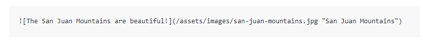

# Markdown 语法

* ## 基础

  - **加粗：** `** **`

  - **斜体：** `* *`

  - **粗斜：** `*** ***`

  - **标识：** ``

  - **分割线：** `***` 或 `---`

  - **换行：** `<br>`

  - **输出字符：** `\字符`

    > \* \- \# 

  - **文字段落：** `> 内容` `>> 嵌套内容`

    >  段落
    >
    > > 嵌套段落

  - **代码块：** ```

    ```
    
    ```

- ## 标题

  - **#：** 一级标题；

  - **##：** 二级标题  ... 以此类推 一共六级标题

- ## 列表

  - **有序列表：** `1. ` 或 `2. ` 或 `3. `
  - **无序列表：**`- ` 或 `* ` 或 `+ ` 或 `- ` 
  - **任务列表：** `- [ ] 未勾选`    `- [x] 勾选的`

- ## 链接

  * **外部链接：** `[链接字](地址 "标题")`  [Markdown Syntax](https://www.markdownguide.org/basic-syntax/ "Markdown语法")

  * **内部链接：** `[链接字](#标题名)`  [跳转至其他](#其他)

  * **直接跳转：** `<地址>`  <https://www.markdownguide.org/basic-syntax/> 

  * **引用链接：** `[链接字][链接引用字]` 

    > The second part of a [reference-style link][1] is formatted with <br>the following attributes

    > [1]: <https://www.markdownguide.org/basic-syntax/> "引用链接"

- ## 图片

  * **普通图片：** ``

    

  * **链接图片：** `[(地址 "链接标题")]`

    []( https://www.markdownguide.org/basic-syntax/)

​		


​	

​	