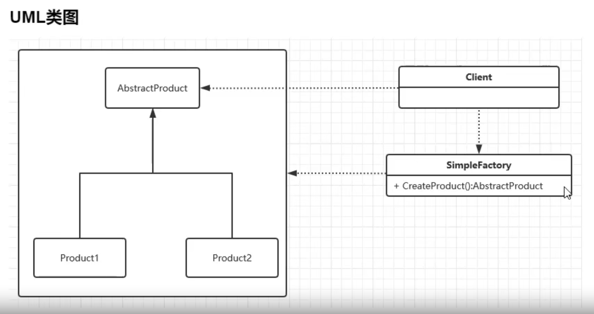
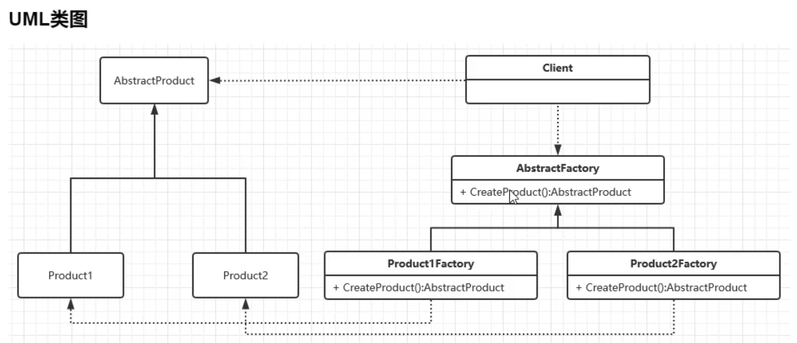
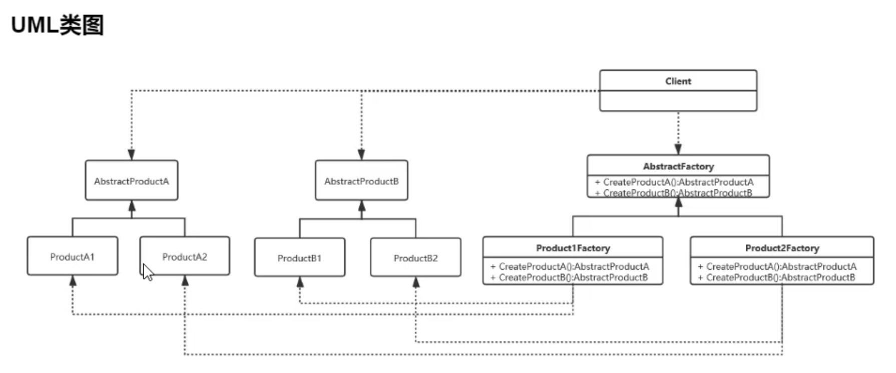

# 工厂模式

- ## 目标

本质就是用工厂方法代替new操作创建一种示例化对象的方式

- ## 分类

  ### 1. 简单工厂

  **含义：**由一个工厂对象决定创建出哪一种产品类的实例，简单工厂又叫做静态工厂方法模式，不属于GOF23种设计模式之一

  **优点：**集中了所有实例的创建逻辑，违反了单一职责原则

  **缺点：**扩展困难，一旦添加新产品就不得不修改工厂逻辑，违反了开闭原则
  
  
  
  
  
  ### 2. 工厂方法
  
  **含义：**定义一个工厂父类，工厂父类负责定义创建对象的公共接口，而字类负责生成具体的对象，即类的示例化延迟到工厂类的字类中完成，由子类决定应该示例化哪一个类。
  
  **优点：**符合设计原则
  
  **缺点：**类的个数成倍增加，增加了系统的复杂度
  
  
  
  
  
  
  
  ### 3. 抽象工厂
  
  **含义：**是工厂方法的升级版，为相关或相互依赖的对象提供一个统一的接口，而无需指定他们的具体实现类
  
  **优点：**对产品族的约束，封装性好
  
  **缺点：**对产品族扩展困难，添加一个产品需要修改抽象和具体工厂类，违反开闭原则
  
  

​	

